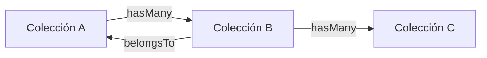

# Resumen de Tablas/Colecciones - [NOMBRE_APP]

**Última Actualización**: YYYY-MM-DD
**Total de Colecciones**: [N]

---

## Inventario de Colecciones

### Colecciones Propias (Read/Write)

| # | Nombre | Título | Campos | Estado | Documentación |
|---|--------|--------|--------|--------|---------------|
| 1 | [nombre_coleccion] | [Título en UI] | [N] | ✅/🚧/⏳ | [Ver doc](colecciones/[NOMBRE].md) |

### Colecciones de Referencia

| # | Nombre | Título | Registros | Fuente | Documentación |
|---|--------|--------|-----------|--------|---------------|
| 1 | ref_[nombre] | [Título] | ~[N] | [HL7/DEIS] | [Ver doc](referencias/[NOMBRE].md) |

### Colecciones Integradas (Read-Only)

| # | Nombre | Título | Fuente | Documentación |
|---|--------|--------|--------|---------------|
| 1 | alma_[nombre] | [Título] | ALMA/TrakCare via SIDRA | [Ver doc](colecciones/ALMA_[NOMBRE].md) |

---

## Estado por Tipo

```
Propias (Read/Write):     [N] colecciones
Referencias (Catálogos):  [N] colecciones
Integradas (Read-Only):   [N] colecciones
─────────────────────────────────────
Total:                    [N] colecciones
```

---

## Progreso de Implementación

| Estado | Cantidad | % |
|--------|----------|---|
| ✅ Completadas | [N] | [X]% |
| 🚧 En Progreso | [N] | [X]% |
| ⏳ Pendientes | [N] | [X]% |

---

## Colecciones por Módulo/Funcionalidad

### Módulo 1: [Nombre del Módulo]

- `[coleccion_1]` - [Descripción breve]
- `[coleccion_2]` - [Descripción breve]

### Módulo 2: [Nombre del Módulo]

- `[coleccion_3]` - [Descripción breve]

---

## Relaciones Principales



---

## Tamaño Estimado de Datos

| Colección | Registros Estimados | Crecimiento |
|-----------|-------------------|-------------|
| [nombre] | ~[N] | [N]/mes |

---

## Próximos Pasos

1. [ ] [Acción pendiente 1]
2. [ ] [Acción pendiente 2]

---

**Ver**: [README_Modelo.md](README_Modelo.md) para descripción completa del modelo de datos.
