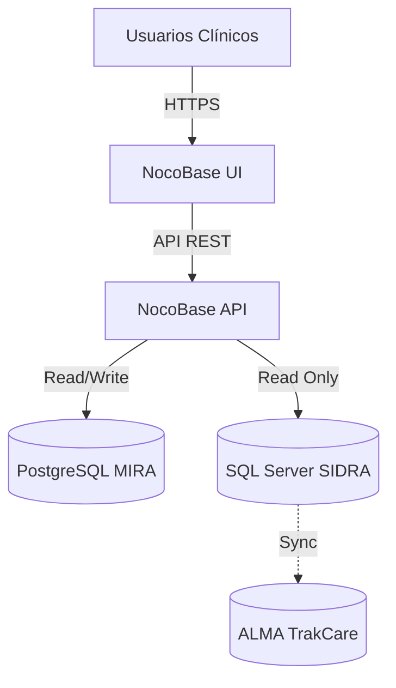

# Arquitectura MIRA

## Visión General
MIRA es una plataforma basada en **NocoBase** diseñada para el Hospital de Ovalle. Su objetivo es centralizar aplicaciones de gestión clínica y administrativa, integrándose con los sistemas core del hospital (ALMA/TrakCare).

## Diagrama de Integración

## Principios de Diseño
1.  **ALMA es la fuente de verdad**: MIRA nunca escribe en ALMA. La integración es de solo lectura a través de SIDRA.
2.  **NocoBase como plataforma**: Se utiliza NocoBase para la UI, gestión de datos y lógica de negocio básica.
3.  **Modularidad**: Cada aplicación (ej. UGCO) debe ser independiente en su definición de datos, aunque comparta recursos transversales.

## Evolución Tecnológica
Actualmente, la interacción con la API se realiza mediante scripts en **Node.js**.
Para el futuro, se evalúa:
-   **TypeScript**: Para mayor robustez en los scripts de automatización.
-   **Microservicios**: Si la lógica de negocio excede las capacidades de NocoBase, se pueden desarrollar servicios externos que interactúen con la API.
-   **Python**: Para tareas de análisis de datos o integración con IA.
